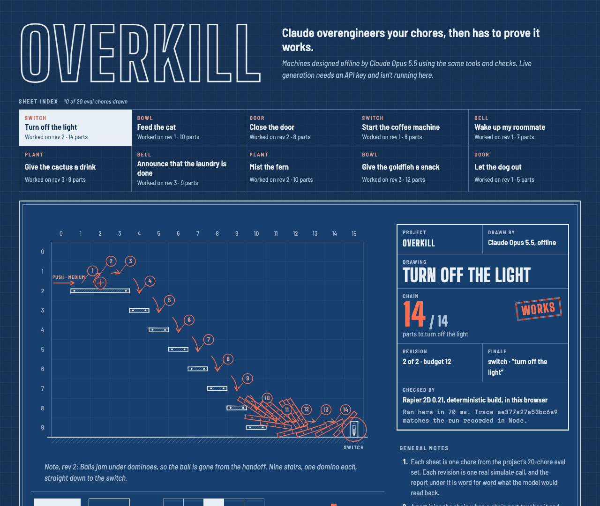

# OVERKILL

> Working name. Claude Opus 5.5 overengineers your chores as chain-reaction machines, then has to prove they work in a physics simulation.



**Machines designed offline by Claude Opus 5.5 using the same tools and checks. Live generation needs an API key and isn't running here.**

## The 30-second experience

Open the site and a machine is already running: a ball, a staircase of thirteen dominoes and a light switch. It runs in Rapier 2D inside your browser, from the machine's JSON blueprint. It is not a video.

- As each part joins the chain, it's redlined like a drafting correction: a numbered balloon and a red-pencil link from the part that set it off.
- When the chain reaches the finale, the switch flips (or the bell rings, or the plant gets watered) and the sheet gets stamped.
- Every chore keeps its full revision history, failures included. Revision 1 of "give the goldfish a snack" missed because a domino pinned the relay ball to the shelf. Revision 2 missed because the relay ball arrived too slowly. Revision 3 works.
- Under each revision is the exact report the model would have read back.
- The title block shows the trace hash your browser computed next to the one recorded in Node.

Controls: play/pause, replay, a time scrubber and five speeds (¼× to 4×). Links point at a sheet and revision (`#/give-the-goldfish-a-snack/2`). Nothing autoplays if you prefer reduced motion.

## How it works

1. A chore goes in ("turn off the light").
2. A designer builds a machine as a JSON blueprint on a 16 × 10 grid: balls, dominoes, planks, seesaws, buckets and a finale. The live agent loop uses Claude Opus 5.5 through the API. The machines on the site were designed offline (see below).
3. A deterministic 2D physics engine (Rapier, deterministic build, pinned to 0.21.0) runs the machine. The model never judges its own work.
4. A trace analyzer turns the run into short feedback: which parts joined the chain, where it stopped and what came closest.
5. The designer gets 12 attempts and 3 previews before each one. A success needs a chain of at least 5 parts that reaches the finale, and the finale must stay untouched when nobody pushes. Dropping a ball on the switch doesn't count.

### How the chain is counted

A part is in the chain only if the first push changed where it went.

- Every pushed run also steps a push-free twin of the same machine, in lockstep. The engine is deterministic, so the two are bit-identical until the push.
- A part joins when its pose first leaves its twin's while it is touching a part already in the chain.
- It only counts once the push has moved it at least 5 cm off its push-free path.

So a part that falls, rolls or settles on its own is never credited, and neither is a domino that merely wobbled. A bucket riding a tipping seesaw is credited, and so is a part that was already moving when the chain knocked it somewhere new.

An older motion-threshold rule got the first two cases wrong. On 553 random machines, switching rules changed no outcome.

The rule isn't perfect:

- It can undercount. If the push only *delays* a part the chain would have hit anyway, that part isn't credited.
- When two chain parts touch the same part, it credits whichever affected it first. That can make the reported path a little longer or shorter than a person would draw it.

Details are in [the design spec, §13](docs/superpowers/specs/2026-09-25-overkill-design.md).

## The offline machines

The site shows 10 of the 20 chores in the eval set. They were designed by Claude Opus 5.5 working offline through `npm run design`. That harness gives the designer the agent loop's own `preview` and `simulate` tools with no model and no network:

- The same checks run through one shared function, `judgeAttempt`: schema, starting overlaps, physics, trace analysis and the no-push rule.
- The same budget applies: 12 attempts, 3 previews per attempt, stop at the first success.
- It prints the same feedback text.
- Every `simulate` call is appended to `machines/<chore>.json` and can't be rewritten.

| Chore | Finale | Attempts | Chain | Parts on the board |
|---|---|---|---|---|
| turn off the light | switch | 2 | 14 | 22 |
| feed the cat | bowl | 1 | 10 | 16 |
| close the door | door | 2 | 8 | 12 |
| start the coffee machine | switch | 1 | 8 | 12 |
| wake up my roommate | bell | 1 | 7 | 9 |
| give the cactus a drink | plant | 3 | 9 | 12 |
| announce that the laundry is done | bell | 3 | 9 | 13 |
| mist the fern | plant | 2 | 10 | 14 |
| give the goldfish a snack | bowl | 3 | 12 | 17 |
| let the dog out | door | 1 | 5 | 11 |

That's 19 attempts in total, 9 of them failures, all kept. `tests/machines/machines.test.ts` re-simulates every stored attempt and checks its outcome, feedback, chain and trace hash. If an engine or rule change alters any stored run, the test fails.

**This is not an eval of the live agent.** The offline designer could read this repository's source, including the engine's geometry. The live model only gets the system prompt and the tool feedback. Several designer sessions worked in parallel, one set of chores each. Don't read "10 of 10 worked" as a success rate for Opus 5.5 through the API: the paid spike (below) measures that, and it hasn't been run.

To design your own, run:

```bash
npm run design -- --list
npm run design -- --chore feed-the-cat --prompt                       # the rules the model gets
npm run design -- --chore feed-the-cat --preview --blueprint my.json  # free
npm run design -- --chore feed-the-cat --blueprint my.json            # uses an attempt, recorded
```

## Why TypeScript

The same code has to run in three places and agree to the bit:

- the agent loop in Node,
- the offline harness,
- the visitor's browser.

Rapier ships official JavaScript bindings for its deterministic WebAssembly build. So one TypeScript core (`src/core`: blueprint schema, geometry, simulation, trace analysis) runs unchanged under Node and inside the Vite bundle. The browser runs the exact function the loop uses (`judgeAttempt`), not a port of it.

## Build and test

Needs Node 22.

```bash
npm install
npm test            # 222 unit tests: core, trace, harness, agent loop, spike, stored machines, site config
npm run typecheck   # Node code, web app and browser tests
npm run build       # writes dist/ (static site, _headers, THIRD-PARTY-NOTICES.txt)
npm run test:e2e    # builds, then checks dist/ in headless Chromium
```

`npm run test:e2e` serves `dist/` locally with the headers from `dist/_headers` applied, so the Content Security Policy is live. It then checks four things:

- Every stored attempt run in the browser reaches the same trace hash as Node, with no console errors or CSP violations.
- The site autoplays, and fits a 400 px screen without sideways scrolling.
- Reduced motion turns autoplay off.
- A bad link gets a clear message.

It needs a Chromium: `npx playwright-core install chromium`, or set `CHROMIUM_PATH`.

`npm run dev` starts a local dev server.

## Hosting on Cloudflare Pages (free)

The site is fully static: HTML, one CSS file, two JS files, fonts and a text file, about 3.7 MB before compression. There is no server code, no API call and no storage.

The physics chunk is 3.4 MB (1.3 MB gzipped), because Rapier's WebAssembly is inlined. It loads after the drawing is already on screen. Cloudflare's free Pages tier serves unlimited static requests, with limits of 20,000 files per site and 25 MiB per file. This site uses 17 files and nothing close to the size limit.

`dist/_headers` sets:

- a strict CSP: `default-src 'none'`, scripts only from the site plus `'wasm-unsafe-eval'` (which Rapier's WebAssembly needs), styles and fonts only from the site, and no framing,
- `nosniff`,
- `no-referrer`,
- long-lived caching only for content-hashed files in `/assets/`.

Public readers can deploy their own copy with `npx wrangler pages deploy dist --project-name <name>`. The owner deploys through a guarded script that pins the Ramen Protocol Cloudflare account, never through a plain `wrangler` login.

## The paid spike (unchanged)

The go/no-go spike runs the real Opus 5.5 agent loop on all 20 chores. It uses real API calls and costs money. It needs an Anthropic API key in `RAMEN_ANTHROPIC_API_KEY`, ideally in a workspace with a spend limit. It hasn't been run.

```bash
npm run spike -- --limit 2 --max-cost 10   # smoke test
npm run spike                               # all 20 chores, cost cap $30
```

The spike stops before the next call could take spending past the cap (`--max-cost`, default $30, minimum $2). Before each call it assumes the worst: at least $2, and more once a conversation gets long (the previous reply's tokens plus 20k, all priced as cache writes, plus a full 64k-token reply).

What counts toward the cap:

- A finished reply: the usage the API reports.
- A reply whose stream breaks or hits the 10-minute call timeout: the input and cache tokens reported when the stream started, plus a full 64k tokens of output. The real output count only arrives at the end of the stream, so the spike assumes the most it could have been.
- A call that fails before the API reports any usage: nothing.

A run cut off by the cap is reported separately. The verdict is marked provisional in any of these cases:

- the cost cap or an API rejection stops the spike,
- any run ends in an API error, including a timeout.

With no completed runs there is no verdict. A `--limit` run is judged against all 20 chores, so it is never GO.

Results are written to `results/<timestamp>/` (`runs.jsonl` and `summary.md`). `summary.md` is rewritten after every chore, so an interrupted spike keeps its report.

## Honest limitations

- **No live generation.** Nothing on the site calls a model. The machines were designed offline, and the designer had more context than the live model gets (see above).
- **Chain credit is a rule, not a judgement.** It can undercount, and it can pick a different path than a person would. See [How the chain is counted](#how-the-chain-is-counted).
- **Determinism is checked, not guaranteed everywhere.** The browser test covers headless Chromium on one machine. Rapier's deterministic build is designed to match across platforms. When a browser's hash doesn't match, the page says so instead of hiding it.
- **Some machines are simpler than they look.** In "let the dog out" the ball took a shortcut past the crate and seesaw, so only 5 of its 11 parts are in the chain. The page shows exactly that. "Turn off the light" is mostly dominoes.
- **Finale drawings are symbols.** Each finale is a fixed 0.4 × 0.8 target. The switch, bowl, bell, door and plant are drawn on top of it, and their reactions (the lever flips, the bell swings) are animation, not physics.
- **One visual theme.** The site is a cyanotype blueprint only; there is no light theme.

## Next

- Run the paid spike, then publish its eval (success rate, attempts, cost) next to the offline machines.
- Draw the other 10 chores.
- "Break Claude's machine": let a visitor drag one part and rerun it in the browser.
- The live loop behind a Worker with a daily budget, once there's an API key to spend.

## Built with

- Claude Opus 5.5 (`claude-opus-5-5`), which wrote the code with AI assistance and designed the machines. AI-assisted development is part of how this project is built and is visible in the commit history.
- Rapier 2D (`@dimforge/rapier2d-deterministic-compat`, Apache-2.0), zod (MIT) and Vite.
- Big Shoulders Display, Barlow Semi Condensed and Martian Mono (SIL Open Font License).

Full notices ship with the site as `THIRD-PARTY-NOTICES.txt`.

## License

MIT
